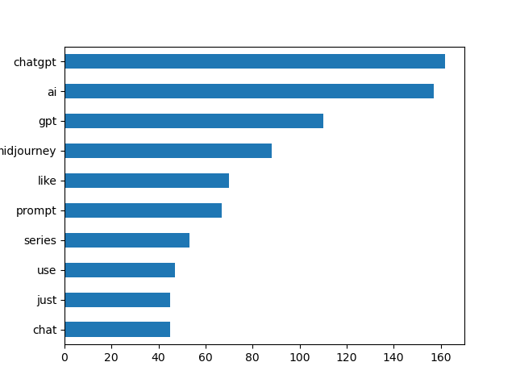
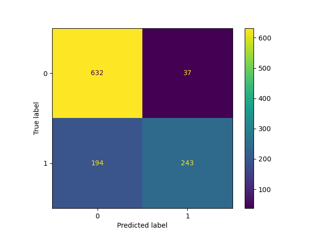
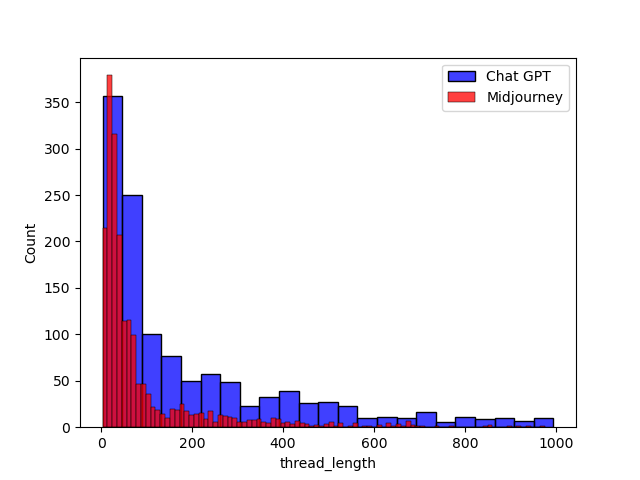
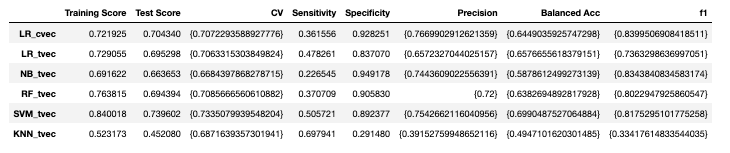

### Problem Statement: You are a financial analyst trying to classify media articles by subtopic across many media sources for subsequent sentiment analysis. To do this, build and optimize a model to classify posts from two different but similar subreddits, in this case ChatGPT and Midjourney. 

#### Data Collection
In this project I used the PRAW Reddit API Python wrapper to pull subreddit posts. I decided to use 'ChatGPT' and 'Midjourney' as two similar but slightly different subreddits. The API would only let me pull around 1000 posts on the initial pull and thereafter generally limited me to around 100 or so per day. For the final dataset I had around 3300 posts, roughly 60% of which were from the Midjourney subreddit.

The code for the API pull, along with the combination and removal of duplicate entries is in the Reddit_API_data_final.ipynb file.

#### EDA 

- I imported our data from the earlier Reddit API pulls in two csvs which I then joined. 
- I converted the 'ChatGPT' and 'Midjourney' categories to 1/0 for regression and I reset the index.

- We then established a baseline. Midjourney was 60.4% of the dataset, so if our model could do better than this (ie always predicting the majority class), then there was value in our model.
- I then looked at most common words in the dataset and unsurprisingly it was for example 'ChatGPT' and 'AI'.
- I also did the same for each subreddit.
- I then ran a first pass LR model on the titles only and I got a test score of 0.81, though with weak identification of ChatGPT, the minority class (57% sensitivity).
- I then added post content and this improved the test score by 3pp but dramatically improved the sensitivity to 64% which was good.
- However, the model was still highly overfit and also benefitted from very high coefficient feature words in the training set such as 'midjourney' or 'v6'. I looked at high coefficient words and removed the most obvious. 
    

As expected, this casued a drop in performance by 0.05 on the test score and the model still had weak identification of the ChatGPT class.
    
    
- As a last piece of EDA I looked at thread length (title + post) to see if there was any meaningful difference and ChatGPT threads were much longer. This likely has some impact in terms of the language, in that many of the titles are basically picture titles vs more in depth stack overflow style questions and discussions in ChatGPT. It also might explain why the model is good at identifying Midjourney subreddits, but far weaker at identifying ChatGPT subreddits.

    

#### Modelling
- I then tried a number of models, which I hyperparameter optimized using GridSearch. This led to a meaningful drop in performance (largely due to a much smaller feature set), but train and test scores were far closer together, and test scores/ cross val scores, so the models were generalizing well to the test data.

    

#### Evaluation and conclusions 
- I evaluated the model on a number of metrics, but the most effective model was Support Vector Machines, using TF-IDF. The SVM model also had the highest sensitivity (other than KNN which performed poorly) and the highest balanced accuracy.
- SVM is generally quite effective in dealing with unbalanced datasets and complex decision boundaries, which is likely the case for our data given the closeness of the subject matters.
- The model misclassifies almost half the ChatGPT subreddits but only misclassifies around 11% of the Midjourney subreddits. All models struggled with this and I believe this is due to 1) ChatGPT being the minority class 2) Midjourney posts being shorter and generally containing more 'title like' words which are easier to classify.
- Overall, our model materially outperformed the baseline (60.4%) and so is doing a much better job vs random guessing.

- Lastly, I experimented with adjusting the prediction threshold on SVM to see if this helped, but it actually led to a slightly worse result overall.

